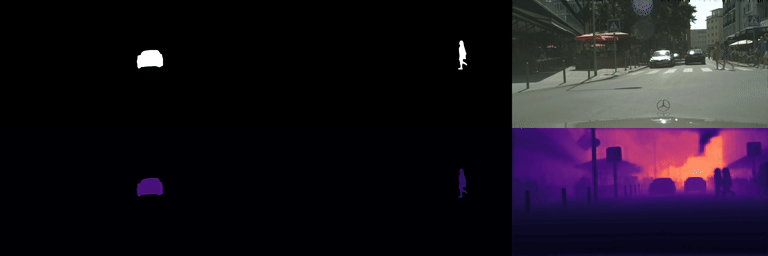
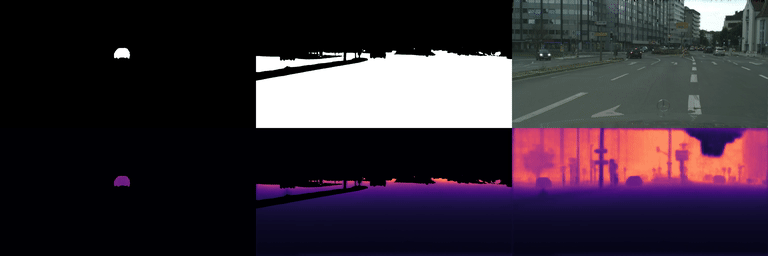

# 🎵PolyphonicFormer: Unified Query Learning for Depth-aware Video Panoptic Segmentation

**PolyphonicFormer is the winner method of the ICCV-2021 SemKITTI-DVPS [Challenge](https://motchallenge.net/workshops/bmtt2021/).** 

**PolyphonicFormer is accepted by [ECCV '22](https://eccv2022.ecva.net/), Tel Aviv, Israel.**

[](https://paperswithcode.com/sota/depth-aware-video-panoptic-segmentation-on?p=polyphonicformer-unified-query-learning-for)

	
[](https://paperswithcode.com/sota/depth-aware-video-panoptic-segmentation-on-1?p=polyphonicformer-unified-query-learning-for)

[Haobo Yuan](https://yuanhaobo.me)\*,
[Xiangtai Li](https://lxtgh.github.io)\*,
[Yibo Yang](https://iboing.github.io),
[Guangliang Cheng](https://scholar.google.com/citations?user=FToOC-wAAAAJ),
[Jing Zhang](https://scholar.google.com/citations?user=9jH5v74AAAAJ), 
[Yunhai Tong](https://eecs.pku.edu.cn/info/1475/9689.htm),
[Lefei Zhang](https://sites.google.com/site/lzhangpage/),
[Dacheng Tao](https://www.sydney.edu.au/engineering/about/our-people/academic-staff/dacheng-tao.html).

[[pdf](https://www.ecva.net/papers/eccv_2022/papers_ECCV/papers/136870574.pdf)] [[supp](https://www.ecva.net/papers/eccv_2022/papers_ECCV/papers/136870574-supp.pdf)] [[arxiv](https://arxiv.org/abs/2112.02582)] [[code](https://github.com/HarborYuan/PolyphonicFormer)] [[poster](https://huggingface.co/HarborYuan/PolyphonicFormer/resolve/main/4533.pdf)]

## Demo




## Installation (Optional)
You do not need to install the environment if you have docker in your environment. We already put the pre-built docker image on [docker hub](https://hub.docker.com/r/harbory/polyphonicformer). If you want to build the docker image by yourself, please run the following command in `scripts/docker_env`.
```commandline
docker build -t polyphonicformer:release . --network=host
```
Please refer to the dockerfile for environment details if you insist on using conda.

## Datasets Preparation
You can download the Cityscapes-DVPS datasets [here](https://huggingface.co/HarborYuan/PolyphonicFormer/resolve/main/cityscapes-dvps.zip), and SemKITTI-DVPS datasets [here](https://huggingface.co/HarborYuan/PolyphonicFormer/resolve/main/semkitti-dvps.zip). Suppose your path to datasets is DATALOC, please extract the zip file and make sure the datasets folder looks like this:
```
DATALOC
|── cityscapes-dvps
│   ├── video_sequence
│   │   ├── train
│   │   │   ├── 000000_000000_munster_000105_000004_leftImg8bit.png
│   │   │   ├── 000000_000000_munster_000105_000004_gtFine_instanceTrainIds.png
│   │   │   ├── 000000_000000_munster_000105_000004_depth.png
│   │   │   ├── ...
│   │   ├── val
│   │   │   ├── ...
|── semkitti-dvps
│   ├── video_sequence
│   │   ├── train
│   │   │   ├── 000000_000000_leftImg8bit.png
│   │   │   ├── 000000_000000_gtFine_class.png
│   │   │   ├── 000000_000000_gtFine_instance.png
│   │   │   ├── 000000_000000_depth_718.8560180664062.png
│   │   │   ├── ...
│   │   ├── val
│   │   │   ├── ...
```
Please make sure you know that the Cityscapes-DVPS and SemKITTI-DVPS datasets are created by the authors of [ViP-Deeplab](https://github.com/joe-siyuan-qiao/ViP-DeepLab).

## Docker Container
After you prepared the datasets, you can create and enter a docker container:
```commandline
DATALOC={/path/to/datafolder} LOGLOC={/path/to/logfolder} bash tools/docker.sh
```
The DATALOC will be linked to data in the project folder, and the LOGLOC will be linked to `/opt/logger`.

## Getting Start
Let's go for 🏃‍♀️running code.
### Image training
```commandline
bash tools/dist_train.sh configs/polyphonic_image/poly_r50_cityscapes_2x.py 8 --seed 0 --work-dir /opt/logger/exp001
```
### Image testing
```commandline
bash tools/dist_test.sh configs/polyphonic_image/poly_r50_cityscapes_2x.py https://huggingface.co/HarborYuan/PolyphonicFormer/resolve/main/polyphonic_r50_image.pth 8
```

### Video training
```commandline
bash tools/dist_train.sh configs/polyphonic_video/poly_r50_cityscapes_1x.py 8 --seed 0 --work-dir /opt/logger/vid001 --no-validate
```

### Video testing
```commandline
PYTHONPATH=. python tools/test_video.py configs/polyphonic_video/poly_r50_cityscapes_1x.py https://huggingface.co/HarborYuan/PolyphonicFormer/resolve/main/polyphonic_r50_video.pth --eval-video DVPQ --video-dir ./tmp
```
To test your own training results, just replace the online checkpoints to your local checkpoints. For example, you can run as the following for video testing:
```commandline
PYTHONPATH=. python tools/test_video.py configs/polyphonic_video/poly_r50_cityscapes_1x.py /path/to/checkpoint.pth --eval-video DVPQ --video-dir ./tmp
```

## Acknowledgements
The image segmentation model is based on [K-Net](https://github.com/ZwwWayne/K-Net). The datasets are extracted from [ViP-Deeplab](https://github.com/joe-siyuan-qiao/ViP-DeepLab).
Please refer them if you think they are useful.
```bibtex
@article{zhang2021k,
  title={K-Net: Towards Unified Image Segmentation},
  author={Zhang, Wenwei and Pang, Jiangmiao and Chen, Kai and Loy, Chen Change},
  journal={NeurIPS},
  year={2021}
}
@inproceedings{qiao2021vip,
  title={ViP-DeepLab: Learning Visual Perception with Depth-aware Video Panoptic Segmentation},
  author={Qiao, Siyuan and Zhu, Yukun and Adam, Hartwig and Yuille, Alan and Chen, Liang-Chieh},
  booktitle={CVPR},
  year={2021}
}
```

## Citation
If you think the code are useful in your research, please consider to refer PolyphonicFormer:
```bibtex
@inproceedings{yuan2022polyphonicformer,
  title={Polyphonicformer: Unified Query Learning for Depth-aware Video Panoptic Segmentation},
  author={Yuan, Haobo and Li, Xiangtai and Yang, Yibo and Cheng, Guangliang and Zhang, Jing and Tong, Yunhai and Zhang, Lefei and Tao, Dacheng},
  booktitle={ECCV},
  year={2022},
}
```
