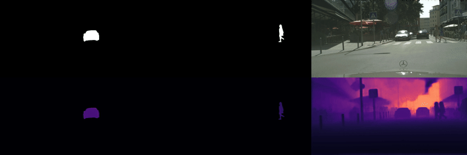
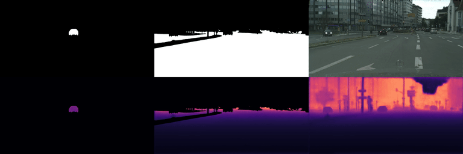

# PolyphonicFormer: Unified Query Learning for Depth-aware Video Panoptic Segmentation

Winner method of the ICCV-2021 SemKITTI-DVPS [Challenge](https://motchallenge.net/workshops/bmtt2021/).

[[arxiv](https://github.com/HarborYuan/PolyphonicFormer)] [[code](https://github.com/HarborYuan/PolyphonicFormer)]

## Introduction
In this repo, we present PolyphonicFormer, a unified framework for Depth-aware Video Panoptic Segmentation (DVPS). 

## Demo

